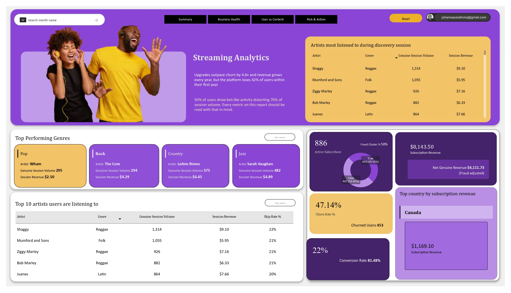
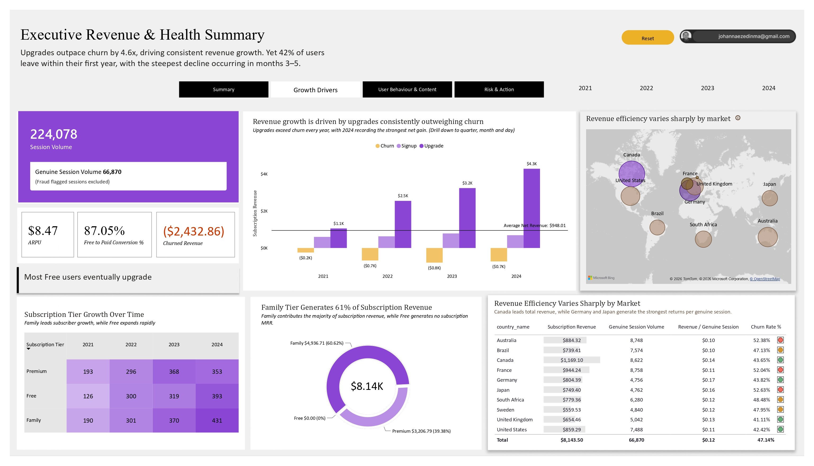
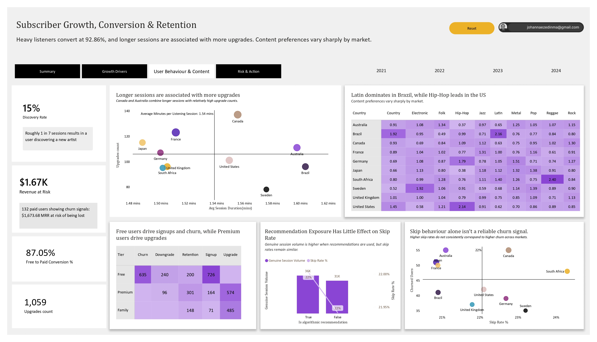
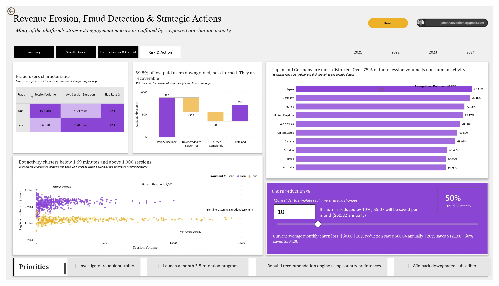

# Music Streaming Platform Performance Analytics 
**Date:** May 2026  

**Tools:** Power BI · DAX · Power Query     
**Period:** 2021 to 2024 · 10 markets · 961 users · 224,078 sessions     

  

> A four-year investigation into whether the platform's growth is sustainable, what drives subscriber conversion, where revenue is leaking, and whether the data used to make business decisions can be trusted.

---

## Overview

A Music streaming platforms operating across multiple markets face a core challenge: strong headline growth does not always reflect a healthy business. High session volume may not translate into sustainable revenue, recommendation engines may fail to influence user behaviour, and engagement metrics themselves may be distorted by non-human activity.

## The Business Problem

According to Spotify's 2023 annual report, subscriber churn remains one of the most expensive challenges in the streaming industry. For a mid-size platform without a billion-dollar marketing budget, every churned subscriber is harder to replace and every investment decision made on bad data compounds the problem.

This investigation separates genuine business performance from misleading signals and answers four critical questions:
 
1. Is the platform truly growing?
2. What behaviours drive subscriber conversion and churn?
3. Is the recommendation strategy working?
4. How much of engagement data can be trusted?

Without answers to these questions, the business risks investing in the wrong markets, optimising ineffective recommendation systems, and losing recoverable subscribers through untargeted retention efforts.

---
### What the Data Revealed

The business has delivered consistent year-on-year revenue growth, supported primarily by subscriber upgrades rather than new customer acquisition.

However, three findings immediately stand out:

- Revenue continues to increase each year. 
- Nearly 42% of users leave within their first year. 
- Almost half of recorded user activity appears to be non-human, meaning several headline engagement metrics overstate actual platform performance.

Although the platform is commercially healthy today, future growth depends on retaining more users and ensuring business decisions are based on genuine customer behaviour rather than inflated activity

---

## Growth Drivers

**Revenue is growing, but retention remains the weakest part of the business.**

The analysis shows that subscriber upgrades generate substantially more revenue than churn removes, producing positive net revenue growth throughout the four-year period. December consistently delivers the strongest financial performance, suggesting seasonal purchasing behaviour. The Family tier alone drives 61% of all subscription revenue despite representing the smallest tier by user count at launch.

The largest decline occurs during months three to five after signup, where almost half of first-year users leave the platform before becoming long-term subscribers, the same window the industry calls the "trial cliff," where initial excitement fades and uncommitted users quietly disappear. This is the single most fixable revenue leak in the business.

Geographic analysis also reveals significant differences in commercial performance. Countries such as Canada and France generate stronger revenue relative to their session volume, while other markets generate high engagement without equivalent financial returns.

### Key Insight

The business is not struggling to generate revenue.

It is struggling to retain customers long enough to maximise their lifetime value.

### Business Recommendation

Launching a targeted retention programme specifically for users in months 3 to 5 will solve this. Session frequency monitoring is the right early warning signal; users who stop logging in are far more predictive of churn than users who skip songs

---

## User Behaviour & Content Performance

**User behaviour explains why some customers convert while others leave.**

The analysis shows that engagement depth is a much stronger predictor of conversion than simple activity volume.

Users who spend longer listening are significantly more likely to upgrade to paid subscriptions than users who simply generate large numbers of sessions.

Skip rate, however, shows almost no relationship with churn, making it an unreliable retention indicator.

The recommendation engine also contributes little measurable value. Algorithmically recommended tracks perform almost identically to organically discovered content, suggesting the current recommendation strategy is neither improving nor harming user engagement.

Where meaningful differences do emerge is across geographic markets. Different countries consistently favour different genres, creating opportunities to personalise recommendations using regional listening behaviour rather than a universal recommendation model.

### Key Insights

- Longer listening sessions predict upgrades.
- Skip rate is a poor predictor of churn.
- Local content preferences vary substantially by country.
- The recommendation engine currently adds little measurable value.

### Business Recommendation

Improve recommendation models by incorporating country-level listening preferences while monitoring session frequency and listening duration as early indicators of churn risk.

---

## Data Integrity, Risk & Strategic Actions

**The biggest business risk is that many engagement metrics cannot be fully trusted.**

Nearly 50% of users exhibit activity patterns consistent with automated streaming behaviour, generating more than twice as many sessions while spending considerably less time listening than genuine users. In Japan and Germany, fraudulent activity accounts for more than 75% of recorded session volume.

Once fraudulent users are excluded, genuine engagement is substantially lower than headline platform metrics suggest. This means several business decisions based solely on raw session volume could be misleading.

The investigation also identifies a significant retention opportunity.

Among paid subscribers who left the platform, almost 60% downgraded to a lower subscription tier rather than cancelling completely. These users remain active within the platform and represent a much stronger reactivation opportunity than fully churned subscribers.

The interactive churn simulator demonstrates the financial impact of improving retention, allowing stakeholders to estimate potential revenue savings under different churn-reduction scenarios.

### Highest Priority Actions

1. Investigate markets heavily affected by fraudulent activity before making marketing or content investment decisions.
2. Launch targeted retention campaigns during months three to five of the customer lifecycle.
3. Develop personalised win-back campaigns for downgraded subscribers.
4. Rebuild recommendation logic using regional listening preferences.
5. Report fraud-adjusted engagement metrics alongside headline platform KPIs.

---

# Conclusion

This investigation demonstrates that strong headline growth does not always reflect a healthy business.

Although subscription revenue continues to increase and upgrades consistently outweigh churn, the platform's long-term performance is constrained by three structural challenges:

- Weak early customer retention.
- Limited impact from the recommendation engine.
- Engagement metrics distorted by non-human activity.

By improving retention during the highest-risk stage of the customer lifecycle, personalising recommendations using regional listening behaviour, re-engaging downgraded subscribers, and incorporating fraud-adjusted reporting into executive decision-making, the platform can improve customer lifetime value while making more informed strategic decisions.

Ultimately, the objective of this project was not simply to describe what happened, but to distinguish genuine business growth from misleading signals and identify the actions most likely to improve long-term performance.

---

## Report Structure

The report is organised across four pages that tell one connected story.

**Summary** — Provides an executive overview of business performance, headline KPIs and the most important findings.

**Growth Drivers** — Explores revenue trends, subscription movement, retention performance and geographic revenue contribution.

**User  Behaviour and Content** — Examines subscriber behaviour, conversion drivers, recommendation effectiveness and regional content preferences.

**Risk & Action** — Investigates fraud, identifies recoverable revenue opportunities and quantifies the impact of reducing churn.

---

## Methodology Notes

**Fraud cluster** refers to users flagged by the source dataset as exhibiting behavioural patterns consistent with automated streaming activity.

**Genuine session volume** refers to sessions from users where is_fraud_cluster = FALSE. All content performance rankings use genuine session volume rather than total volume to ensure rankings reflect real listener behaviour.

**Over-index** values above 1.0 mean a genre represents a higher share of sessions in that country than globally. A value of 2.16 for Latin in Brazil means Latin is 2.16 times more popular there than the global average.

**Cohort retention** tracks the percentage of users from each signup month still active at each monthly milestone after joining not at calendar months. This allows fair comparison across cohorts regardless of when they joined.

**Session revenue versus subscription revenue** are kept strictly separate throughout this report. Session revenue (estimated_revenue_usd) is an analytical estimate of per-stream value used for content rankings only. Subscription revenue (mrr_change_usd) is the actual MRR movement used for all business health metrics. Combining them would create double counting.

---

## Tools Used

| Tool | Purpose |
|------|---------|
| Power BI Desktop | Report building, visualisation and data modelling |
| DAX | Calculated measures and analytical metrics |
| Power Query (M) | Data transformation and modelling |
