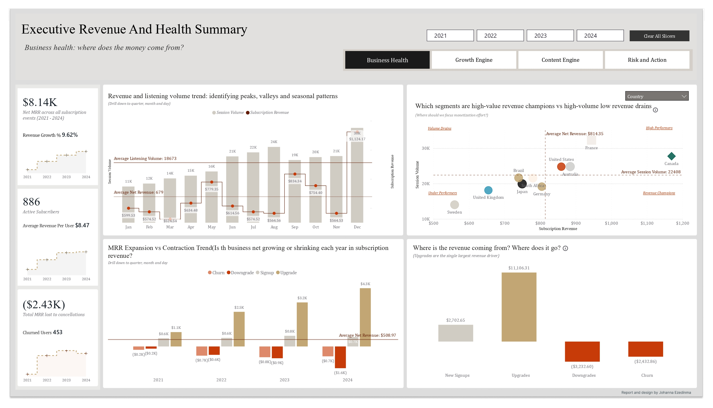
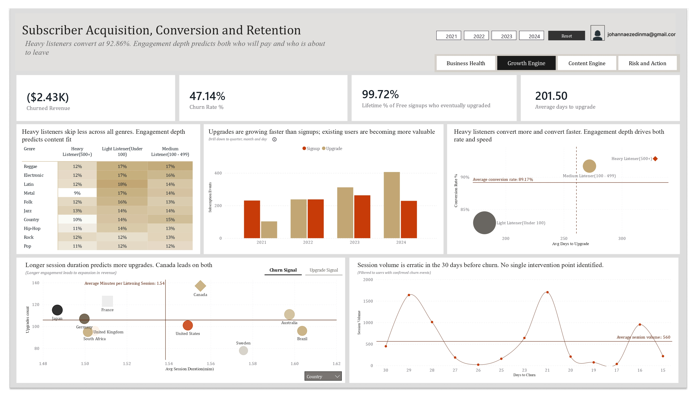
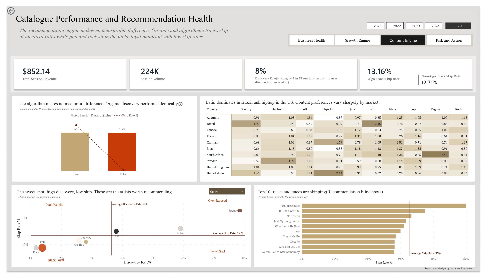
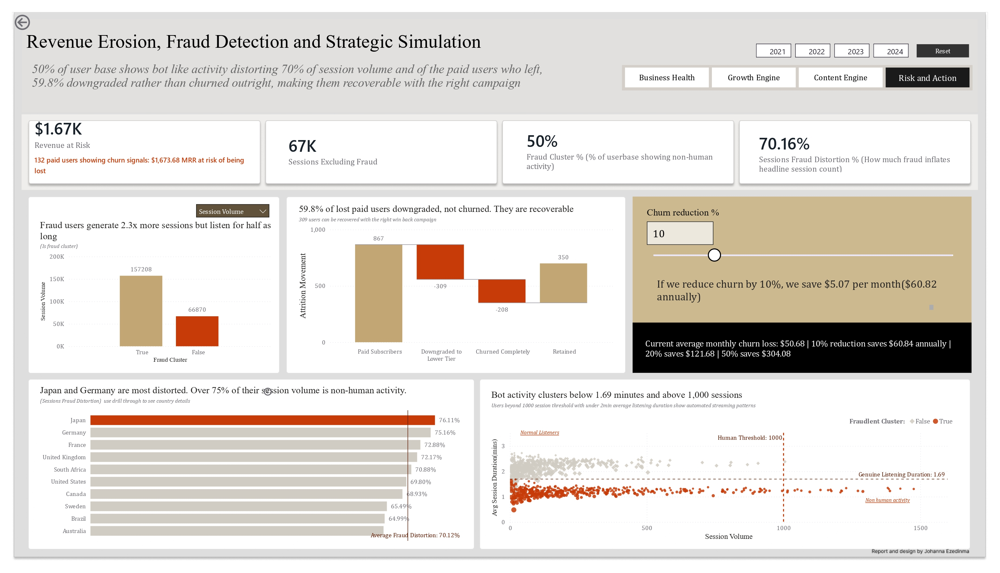

# Music Streaming Platform Performance Analytics

> A four year investigation into revenue health, subscriber growth, content performance and operational risk across 10 global markets. Built in Power BI with DAX and Power Query.

---

## The Business Problem

A music streaming platform operating across 10 global markets had four years of operational data but limited visibility into what was actually driving revenue, which users were at risk of leaving, whether their content recommendations were working, and how much of their engagement data could be trusted.

Leadership needed answers to four critical questions: Is the business financially healthy? How do we grow and retain subscribers? Is our content strategy working? And where is our revenue at risk?

This report was built to answer all four, in that order, with evidence.

---

## The Approach

Rather than organising the report around what the data contained, every page was structured around what the business needed to decide. The guiding question throughout was: if I were the owner of this platform, what would I need to know?

This approach was the result of a deliberate structure of the report around a single connected story: financial health flows into user behaviour, which flows into content performance, which flows into risk and action.

---

## Project Overview

**Challenge:** Onyx Data DataDNA Music Streaming Analytics Challenge, May 2026

| Metric | Detail |
|---|---|
| Listening sessions | 224,078 |
| Users | 961 |
| Subscription events | 3,640 |
| Tracks | 774 |
| Artists | 448 |
| Markets | 10 countries |
| Period | 2021 to 2024 (48 months) |
| Currency | USD |

---

## Repository Contents

```
📁 Music-Streaming-Platform-Performance-Analytics
│
├── 📄 README.md                  — This file
├── 📄 DATA_DICTIONARY.md         — Full table and column descriptions
├── 📁 dataset/                   — Raw dataset files
│   ├── fact_listening_session.csv
│   ├── fact_subscription_event.csv
│   ├── dim_user.csv
│   ├── dim_artist.csv
│   ├── dim_track.csv
│   ├── dim_genre.csv
│   ├── dim_device.csv
│   ├── dim_country.csv
│   ├── dim_playlist.csv
│   ├── dim_subscription_plan.csv
│   ├── dim_date.csv
│   └── bridge_playlist_track.csv
└── 📁 screenshots/
    ├── page1_business_pulse.png
    ├── page2_growth_engine.png
    ├── page3_content_engine.png
    └── page4_risk_and_action.png
```

---

## Tools Used

| Tool | Purpose |
|---|---|
| Power BI Desktop | Report building, visualisation, data modelling |
| DAX | Calculated measures and columns |
| Power Query (M) | Data transformation and custom table creation |

---

## Dataset Structure

**Fact tables:** `fact_listening_session` and `fact_subscription_event`

**Dimension tables:** 9 dimensions covering users, artists, tracks, genres, devices, countries, playlists, subscription plans and a conformed date dimension

**Bridge table:** `bridge_playlist_track` handling the many-to-many relationship between playlists and tracks

---

## Report Structure

The report is organised into four pages that tell one connected story. Each page ends by naturally raising the question the next page answers.

---

### Page 1 — Executive Revenue & Health Summary

**Question answered:** Is the business financially healthy and where does the money come from?

**Key visuals:** KPI strip covering Net Subscription Revenue, Churned Revenue, ARPU, Active Subscribers and Revenue Growth%; a Revenue Reconciliation Waterfall showing every dollar entering and leaving the business; a Segment Value Distribution Scatter isolating revenue champions from high-volume low-value segments (toggleable by Country, Age Group or Subscription Tier); a Revenue and Session Volume Trend showing peaks, valleys and seasonal patterns across 4 years; and an MRR Expansion vs Contraction chart showing the net positive position year by year.

**Key insight:** Upgrades are the single largest revenue driver at $11,106 in MRR movement, far outpacing the $2,432 lost to churn. The business is net positive every year with December consistently showing the widest gap between new revenue and losses.

**Recommendation:** Double down on upgrade conversion campaigns in Q4 and build a Q1 retention strategy to protect December gains from the post-holiday drop.



---

### Page 2 — Subscriber Acquisition, Conversion & Retention

**Question answered:** How do we grow our subscriber base, who converts, and who is at risk of leaving?

**Key visuals:** A Conversion Funnel by User Listening Tier (Heavy 500+, Medium 100-499, Light under 100 sessions); a Days to Upgrade distribution showing when conversion typically happens after signup; a New Signups vs Upgrades trend over time; a Skip Rate by Genre and Listener Tier matrix showing genre-audience fit across engagement levels; a Churn Signal vs Upgrade Signal scatter chart (bookmark toggle); and a Session Volume chart tracking the 30 days before churn.

**Key insight:** Longer engagement leads to upgrades. Users with deeper session durations upgraded at significantly higher rates than light listeners. Session volume drops noticeably in the 30 days before a user churns, meaning the warning signal is measurable. Importantly, skip rate showed no meaningful difference between churned and retained users (12.87% vs 13.03%), confirming that skip rate alone does not predict churn.

**Recommendation:** Monitor session frequency as the leading churn indicator. Users logging fewer sessions than their historical average are the highest priority for re-engagement campaigns, not users with high skip rates.



---

### Page 3 — Catalogue Performance & Recommendation Health

**Question answered:** What content is working, what are listeners consuming, and is the recommendation engine doing its job?

**Key visuals:** A Content Quadrant Scatter mapping Discovery Rate% vs Skip Rate% by genre or artist (toggleable); an Artist and Genre Treemap showing contribution to total platform streams; an Algorithmic vs Non-Algorithmic Track Performance comparison; a Top 10 Most Skipped Tracks chart highlighting recommendation engine blind spots; and a Subscription Tier Revenue Performance breakdown showing which content earns most per tier.

**Key insight:** The algorithmic recommendation engine is not making a measurable difference. Recommended tracks and non-recommended tracks had virtually identical skip rates at 13.16% vs 12.71%. The platform is leaving personalisation value on the table: organic discovery performs as well as the algorithm without the technical investment.

**Recommendation:** Investigate the recommendation logic. The engine should surface content that reduces skipping and increases session depth. A 13% skip rate on recommended content suggests listeners are not finding what they want through the algorithm.



---

### Page 4 — Revenue Erosion, Fraud Detection & Strategic Simulation

**Question answered:** Where is revenue at risk, what is distorting our data, and what is it worth to fix these problems?

**Key visuals:** An Anomaly Detection Scatter separating genuine listeners from non-human bot activity using session volume and duration thresholds; an Attrition Waterfall showing exactly where paying subscribers go (downgrade vs churn vs retained); a Fraud Distortion by Market bar chart; a Fraud Cluster Behaviour Comparison with a parameter toggle between Sessions, Duration and Skip Rate; and a Churn Reduction Simulator with a dynamic slider calculating monthly and annual revenue impact.

**Key insight 1:** 50% of the user base shows non-human activity patterns: 2.3 times more sessions per user, sessions 46% shorter than normal, near-zero skip rate variation. In Japan and Germany, fraudulent activity distorts over 75% of session volume. Every engagement metric in this report should be read with that caveat in mind.

**Key insight 2:** Of the paid subscribers who left, 59.8% downgraded rather than churned outright. These users made a price or value decision, not a platform abandonment decision. They are recoverable.

**Recommendation:** Launch a targeted win-back campaign for downgraded Premium and Family users specifically. A personalised offer acknowledging their previous tier and offering a discounted upgrade path has a higher success probability than targeting users who churned completely.



---

## Interactive Features

| Feature | Pages | Description |
|---|---|---|
| Year slicer buttons | All pages | Filter entire page by year (2021 to 2024) |
| Field parameter toggle | Pages 1 and 2 | Switch segment view between Country, Age Group and Subscription Tier |
| Bookmark toggle | Page 2 | Switch between Churn Signal and Upgrade Signal scatter |
| Bookmark toggle | Page 3 | Switch between Artist and Genre views |
| Top N slicer | Page 3 | Control how many artists or genres to display |
| Churn simulator slider | Page 4 | Dynamically calculates monthly and annual savings from churn reduction |
| Parameter toggle | Page 4 | Switch fraud comparison between Sessions, Duration and Skip Rate |
| Cross-filtering | All pages | Click any visual to filter the entire page |
| Country drill-through | Pages 1 and 2 | Right-click any country to open the Country Detail page |
| Artist drill-through | Page 3 | Right-click any artist to open the Artist Detail page |
| Fraud drill-through | Page 4 | Right-click any user on the anomaly scatter to open the Fraud Session Detail page |
| Country tooltip | All pages | Hover any country data point for an instant snapshot |

---

## Key DAX Measures

### Revenue

```dax
-- Net subscription revenue across all MRR events
Subscription Revenue =
SUM(fact_subscription_event[mrr_change_usd])

-- Total estimated session-level revenue (ads and royalties)
Total Session Revenue =
SUM(fact_listening_session[estimated_revenue_usd])

-- MRR lost specifically to churn events
Churned Revenue =
CALCULATE(
    SUM(fact_subscription_event[mrr_change_usd]),
    fact_subscription_event[event_type] = "Churn"
)

-- Average revenue per subscriber
ARPU =
DIVIDE(
    [Subscription Revenue],
    DISTINCTCOUNT(dim_user[user_id]),
    0
)
```

### Engagement

```dax
-- Total listening sessions
Session Volume =
COUNTROWS(fact_listening_session)

-- Average session duration in minutes
Avg Session Duration (mins) =
DIVIDE(AVERAGE(fact_listening_session[listen_seconds]), 60)

-- Skip rate as a percentage
Skip Rate % =
DIVIDE(
    CALCULATE(
        COUNTROWS(fact_listening_session),
        fact_listening_session[skipped] = TRUE()
    ),
    COUNTROWS(fact_listening_session)
) * 100

-- Share of sessions where a new artist was discovered
Discovery Rate % =
DIVIDE(
    CALCULATE(
        COUNTROWS(fact_listening_session),
        fact_listening_session[new_artist_discovered] = TRUE()
    ),
    [Session Volume],
    0
)

-- Platform stickiness: daily active users divided by monthly active users
Stickiness (DAU/MAU) =
VAR DAU = AVERAGEX(
    VALUES(dim_date[full_date]),
    CALCULATE(DISTINCTCOUNT(fact_listening_session[user_id]))
)
VAR MAU = CALCULATE(
    DISTINCTCOUNT(fact_listening_session[user_id]),
    ALL(dim_date[full_date])
)
RETURN DIVIDE(DAU, MAU, 0)
```

### Churn and Conversion

```dax
-- Lifetime churn rate
Churn Rate % =
DIVIDE(
    CALCULATE(
        DISTINCTCOUNT(fact_subscription_event[user_id]),
        fact_subscription_event[event_type] = "Churn"
    ),
    DISTINCTCOUNT(dim_user[user_id])
) * 100

-- Free to paid conversion rate using event-level tier tracking
-- Note: ALL(dim_date) is intentional; this is a lifetime metric not a yearly one
Free to Paid Conversion % =
VAR AllFreeSignups =
    CALCULATE(
        DISTINCTCOUNT(fact_subscription_event[user_id]),
        fact_subscription_event[event_type] = "Signup",
        fact_subscription_event[to_tier] = "Free",
        ALL(dim_date)
    )
VAR UpgradedFromFree =
    CALCULATE(
        DISTINCTCOUNT(fact_subscription_event[user_id]),
        fact_subscription_event[event_type] = "Upgrade",
        fact_subscription_event[from_tier] = "Free",
        ALL(dim_date)
    )
RETURN DIVIDE(UpgradedFromFree, AllFreeSignups) * 100
```

### Fraud and Risk

```dax
-- Percentage of users flagged as fraud cluster
Fraud Cluster % =
DIVIDE(
    CALCULATE(COUNTROWS(dim_user), dim_user[is_fraud_cluster] = TRUE()),
    COUNTROWS(dim_user)
) * 100

-- Sessions after excluding fraud-flagged users
Sessions Excluding Fraud =
CALCULATE(
    COUNTROWS(fact_listening_session),
    dim_user[is_fraud_cluster] = FALSE()
)

-- Percentage of session volume distorted by fraud
Sessions Fraud Distortion % =
DIVIDE([Session Volume] - [Sessions Excluding Fraud], [Session Volume])

-- MRR currently held by paid users showing churn signals
Revenue at Risk =
CALCULATE(
    SUMX(
        VALUES(dim_user[user_id]),
        CALCULATE(
            LASTNONBLANKVALUE(
                fact_subscription_event[event_ts],
                SUM(fact_subscription_event[mrr_after_usd])
            )
        )
    ),
    dim_user[Is At Risk] = "At Risk"
)
```

### Simulation

```dax
-- Dynamic monthly revenue saved based on churn reduction slider
Revenue Saved by Churn Reduction =
VAR ChurnReductionRate =
    'Churn Reduction %'[Churn Reduction % Value] / 100
VAR MonthlyChurnLoss =
    ABS(
        CALCULATE(
            SUM(fact_subscription_event[mrr_change_usd]),
            fact_subscription_event[event_type] = "Churn"
        )
    ) / 48
RETURN ROUND(MonthlyChurnLoss * ChurnReductionRate, 2)
```

---

## Power Query Tables

Two custom tables were built in Power Query to support analysis that would have been slow or complex in DAX.

**`free_users_engegement`:** Groups all Free tier listening sessions by user and classifies each into Heavy (500+ sessions), Medium (100 to 499) or Light (under 100) listener tiers. Connected to `dim_user` via `user_id`.

**`user_conversion_timeline`:** Pivots `fact_subscription_event` so each user has one row with dedicated columns for their Signup, Upgrade, Retention, Churn and Downgrade dates. Calculates `days_to_upgrade` and `days_to_churn` as custom columns using `Duration.Days()`. Connected to `dim_user` via `user_id`.

---

## Data Quality Notes

| Issue | Status | Impact |
|---|---|---|
| `dim_date` initially disconnected from fact tables | Fixed: relationships manually established | Time intelligence measures were not filtering correctly |
| `dim_country` and `dim_genre` inactive relationships | Expected: indirect path through `dim_user` is active | No impact on visual filtering |
| Fraud cluster represents 50% of user base | Flagged as a finding, not an error | All engagement metrics should be read alongside Sessions Excluding Fraud |
| `estimated_revenue_usd` is an analytical estimate | Documented | Kept separate from subscription MRR throughout; not combined |

---

## What I Learned

**The story comes before the visuals.** Define what the business needs to understand first, then choose the visuals that tell that story most clearly. Everything else is decoration.

**Counter-intuitive findings are the most valuable.** Skip rate showed no difference between churned and retained users. That null finding is more useful than a positive correlation would have been: it tells the business where NOT to focus its retention efforts.

**Data integrity is part of the analysis.** Discovering that 50% of the user base shows bot-like behaviour is a finding that changes how every other metric in the report should be interpreted.

---

## Links


- **LinkedIn Post:** [Read analysis writeup](https://www.linkedin.com/posts/johanna-ezedinma_onyx-datadna-may-2026-challengemusic-streaming-ugcPost-7465836436701839361-vQRz/?utm_source=share&utm_medium=member_desktop&rcm=ACoAABt242YBPxYi3_waYwYQ1ZF8OBqxB1kjAac) 
- **Challenge:** [Onyx Data DataDNA Challenge](https://onyxdata.co.uk)

---

## Author

**Johanna Ezedinma**


[LinkedIn](https://linkedin.com/in/johanna-ezedinma/) · [GitHub](https://github.com/Johanna-Ezedinma)

