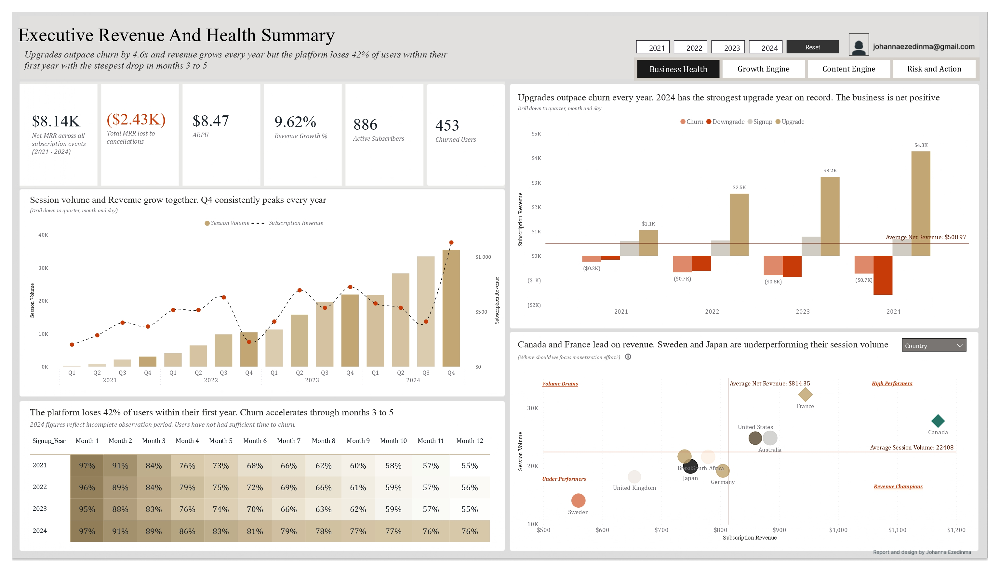

# Music Streaming Platform Performance Analytics
**Author:** Johanna Ezedinma  
**Date:** May 2026   

[](https://www.linkedin.com/in/johanna-ezedinma/) [](https://medium.com/@johannaezedinma/code-blue-emergency-operations-patient-flow-analytics-1cf7176a1ec7) [](https://github.com/Johanna-Ezedinma)


> A four-year investigation into what is driving revenue, who is converting, what content is working and where the data cannot be trusted.


---

## The Business Problem

A music streaming platform operating across 10 markets had four years of data but could not clearly answer four questions that every subscription business needs to answer:

1. Is the business actually growing or just appearing to grow?
2. Which users are most likely to pay and which are about to leave?
3. Is the content strategy and recommendation engine working?
4. How much of our data can we actually trust?

Without answers to these four questions, leadership was making investment and retention decisions based on incomplete information. This report was built to answer all four, in that order, with evidence from the data.

---
## The Approach

Rather than organising the report around what the data contained, every page was structured around what the business needed to decide. The guiding question throughout was: if I were the owner of this platform, what would I need to know?

This approach was the result of a deliberate structure of the report around a single connected story: financial health flows into user behaviour, which flows into content performance, which flows into risk and action.

---

## What the Data Revealed

### The business is growing but losing users too fast

Upgrades are the single largest revenue driver at $11,106 in total MRR movement over four years, outpacing churn losses of $2,432 by more than four to one. Revenue grows every year and December consistently produces the strongest results.

The problem is retention. The platform loses 42% of its users within their first year of signing up. The drop is steepest between months three and five. Think of it like a leaking bucket: money is coming in through upgrades but a significant portion of users are leaving before the business can recoup the cost of acquiring them.



**What this means for the business:** A Q1 retention campaign specifically targeting users in their first six months would directly address the period where the most churn happens.


### Engagement predicts who pays and who leaves

Heavy listeners (users with 500 or more sessions) convert to paid plans at 92.86% compared to 82.93% for light listeners. They also convert faster. The more a user engages with the platform before being asked to pay, the more likely they are to say yes.

On the churn side, session volume in the 30 days before a user churns does not show a clean decline. The pattern is erratic rather than a steady fade, which means there is no single obvious intervention point based on listening behaviour alone. Skip rate is not a useful churn predictor either — churned and retained users skip at almost identical rates (12.87% versus 13.03%).


**What this means for the business:** Focus retention efforts on session frequency monitoring rather than skip rates. A user who stops logging in is a stronger warning signal than a user who skips songs.


### The recommendation engine is not working

Algorithmically recommended tracks and organically discovered tracks have virtually identical skip rates: 13.16% versus 12.71%. The algorithm is neither helping nor hurting. Users are finding content just as well on their own as through the recommendation system.

Looking at genre performance by country, strong content preferences exist in specific markets. Latin music over-indexes 2.16 times in Brazil, Hip-Hop over-indexes 2.14 times in the United States and Reggae over-indexes 2.40 times in South Africa. These are signals the recommendation engine could be using but currently is not reflecting in its output.


**What this means for the business:** The recommendation engine needs to incorporate geographic listening preferences. Recommending Latin music to Brazilian users who are not already listening to it would likely outperform the current approach.


### Half the user base shows bot-like behaviour

50% of users in the dataset show activity patterns consistent with automated streaming: 2.3 times more sessions than normal users, session durations 46% shorter and almost no variation in skip behaviour. In Japan and Germany, fraudulent activity accounts for over 75% of all session volume.

This matters because every engagement metric in this report including total sessions, skip rates and discovery rates is calculated against a dataset where half the activity may not be genuine. The true engagement numbers after excluding fraud-flagged users tell a different story.


**What this means for the business:** Any business decision based on raw session counts or engagement metrics needs to be cross-referenced with fraud-adjusted figures. Japan and Germany in particular need investigation before further content or marketing investment in those markets.


### Most lost paid users are recoverable

Of the paid subscribers who left, 59.8% downgraded to a lower tier rather than cancelling completely. That is 309 users who made a price or value decision, not a decision to leave the platform entirely. They are still reachable.

**What this means for the business:** A targeted win-back campaign offering downgraded Premium and Family users a time-limited return to their previous tier at a reduced rate has a significantly higher success probability than trying to win back users who cancelled completely.

---

## The Report Structure

The report tells one connected story across four pages. Each page answers the question raised by the previous one.

**Page 1: Executive Revenue and Health Summary**
Where does the money come from and is the business financially healthy?

**Page 2: Subscriber Acquisition, Conversion and Retention**
Who is driving that revenue, how do we get more of them and who is about to leave?

**Page 3: Catalogue Performance and Recommendation Health**
Is the content keeping users engaged enough to stay and convert?

**Page 4: Revenue Erosion, Fraud Detection and Strategic Simulation**
How much of our data can we trust and what is it worth to fix the problems we found?

---

## Key Interactive Features

The report is built to be explored not just read. Here is what you can do:

- **Year buttons (2021 to 2024):** Filter every visual on the page to a specific year to see how patterns changed over time
- **Segment toggle on Page 1 scatter:** Switch between Country, Age Group and Subscription Tier to see which segments are revenue champions versus volume drains
- **Churn Signal / Upgrade Signal toggle on Page 2:** Switch between two scatter plots to see which user behaviour predicts upgrades and which predicts churn
- **Country drill-through:** Right-click or hover any country data point and follow the arrow to a full Country Detail page showing that market's churn rate, top genres, device preferences and revenue trend
- **Artist drill-through:** Right-click or hover any artist on Page 3 to see a full Artist Detail page including top tracks, strongest markets and algorithm versus organic performance
- **Fraud drill-through on Page 4:** Right-click any user on the anomaly scatter to see their individual session history and validate whether the fraud flag makes sense for that specific user
- **Churn reduction simulator:** Move the slider on Page 4 to see exactly how much revenue the business would save per month at different churn reduction percentages

---

## Data Quality Notes

Three data issues were identified and documented during the build:

**The date table was not connected.** The `dim_date` table was present in the model but had no active relationship to either fact table. Time intelligence measures were not filtering correctly until the relationships were manually established.

**Two relationships are intentionally inactive.** The direct relationships between `fact_listening_session` and both `dim_country` and `dim_genre` are marked inactive. This is expected because the connections flow correctly through an indirect path via `dim_user`. No data is lost and filtering works correctly through the indirect route.

**The fraud cluster finding changes how to read this report.** With 50% of users flagged as potentially non-human, session volume, skip rate and discovery rate figures are all higher than the genuine user base would produce on its own. Where possible, use the Sessions Excluding Fraud measure rather than total session counts when making business decisions based on this report.

---

## Methodology Notes

**Over-index** means a genre is more popular in a specific country than it is globally. A value of 2.16 for Latin music in Brazil means Latin represents 2.16 times more of Brazil's listening sessions than it represents of global listening sessions. Anything above 1.0 indicates stronger than average interest in that market.

**Cohort retention** tracks what percentage of users who signed up in a given year are still active at each monthly milestone after joining. It is not about calendar months but about months since each user first signed up. This makes it possible to compare whether 2021 users are more or less loyal than 2023 users at the same point in their lifecycle.

**Fraud cluster** refers to users flagged by the `is_fraud_cluster` field in the dataset. These users show behaviour consistent with automated streaming bots: very high session counts, very short session durations and almost no variation in their skip patterns. The flagging was done at the data source level not by this analysis.

---

## Tools Used

| Tool | Purpose |
|---|---|
| Power BI Desktop | Report building, visualisation and data modelling |
| DAX | All calculated measures and columns |
| Power Query (M) | Data transformation and two custom analytical tables |

---

## Dataset Overview

| Detail | Value |
|---|---|
| Listening sessions | 224,078 |
| Users | 961 |
| Subscription events | 3,640 |
| Tracks | 774 |
| Artists | 448 |
| Markets | 10 countries |
| Period | January 2021 to December 2024 |
| Currency | USD |

The dataset follows a star schema with two fact tables (`fact_listening_session` and `fact_subscription_event`), nine dimension tables and one bridge table handling the many-to-many relationship between playlists and tracks.

Two additional tables were built in Power Query for this analysis:

`free_users_engegement` classifies each Free tier user as a Heavy (500 or more sessions), Medium (100 to 499) or Light (under 100) listener based on their total session count. This made it possible to compare conversion rates and behaviour across engagement levels without complex DAX.

`user_conversion_timeline` creates one row per user showing the dates of their key subscription events (signup, upgrade, churn and so on) alongside calculated columns for days to upgrade and days to churn. This powered the cohort analysis and the conversion speed comparisons.

---

## Repository Contents

```
Music-Streaming-Platform-Performance-Analysis
│
├── README.md
├── DATA_DICTIONARY.md
├── dataset/
│   ├── fact_listening_session.csv
│   ├── fact_subscription_event.csv
│   ├── dim_user.csv
│   ├── dim_artist.csv
│   ├── dim_track.csv
│   ├── dim_genre.csv
│   ├── dim_device.csv
│   ├── dim_country.csv
│   ├── dim_playlist.csv
│   ├── dim_subscription_plan.csv
│   ├── dim_date.csv
│   └── bridge_playlist_track.csv
└── Dashboard/
    ├── page1_business_health.png
    ├── page2_growth_engine.png
    ├── page3_content_engine.png
    └── page4_risk_and_action.png
```

---


## Author

**Johanna Ezedinma**

[](https://github.com/Johanna-Ezedinma) [](https://www.linkedin.com/in/johanna-ezedinma/)  

